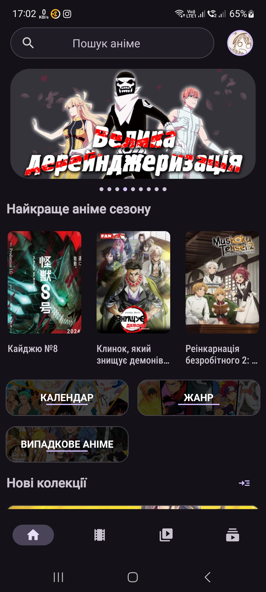
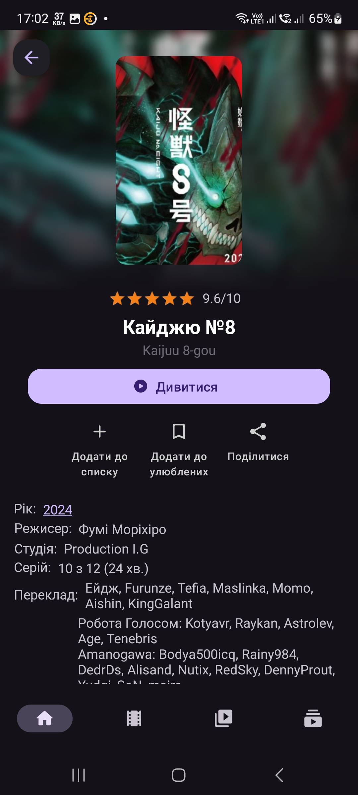
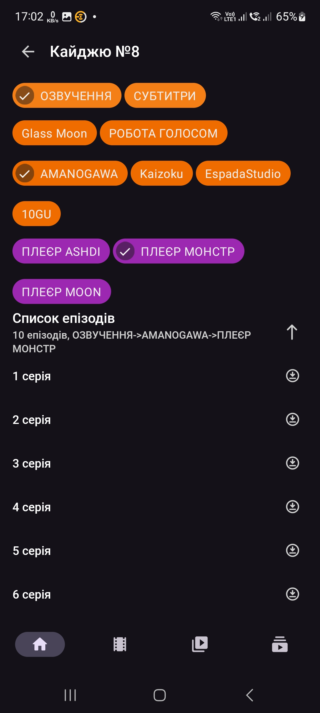
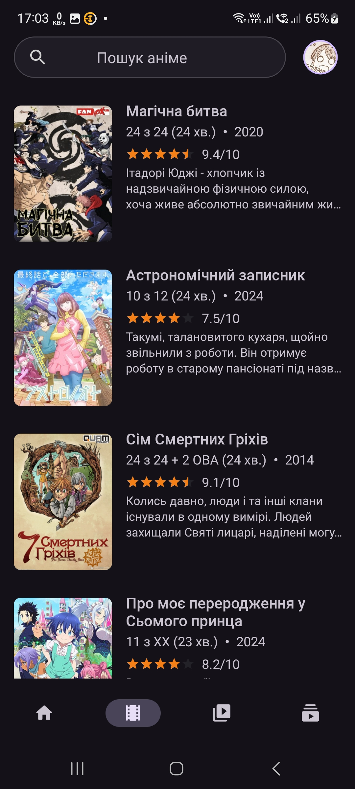
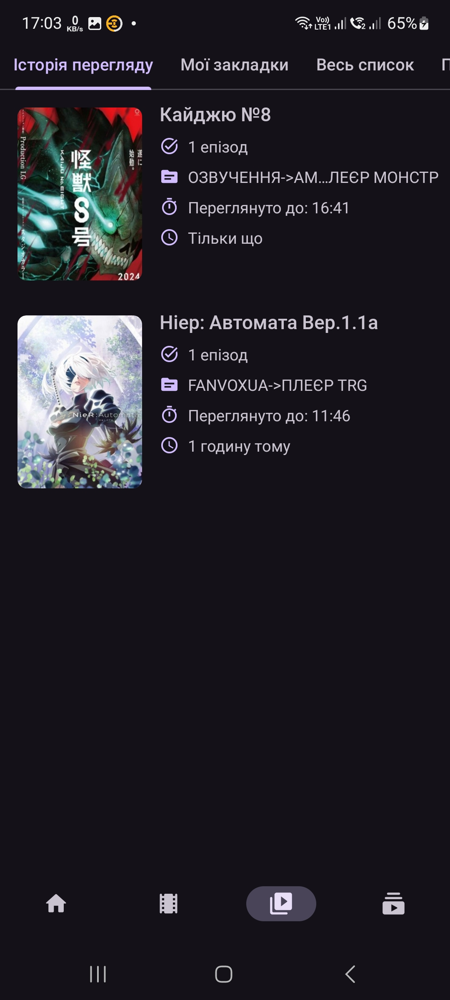

**Anitube App** is a simple [Open Source](https://m.wikipedia.org/wiki/Free_and_open-source_software) android client for [anitube.in.ua](https://anitube.in.ua) to help you watch anime in your phone.

### Screenshots

 

### Features
- Compatible with Android 8.0 and above (API 28+)
- Comes in both light and dark mode.
- Supports dynamic colors on A12+.
- Supports downloads content
- Login in your account
- Watch history
- Supports Picture-in-Picture mode.
- [Material Design 3](https://m3.material.io/) Theme.

### Downloads

### Built with
- [Kotlin](https://kotlinlang.org/)
- [Java](https://dev.java/)
- [Coroutines](https://kotlinlang.org/docs/reference/coroutines-overview.html)
- [Android Architecture Components](https://developer.android.com/topic/libraries/architecture)
    - [LiveData](https://developer.android.com/topic/libraries/architecture/livedata)
    - [ViewModel](https://developer.android.com/topic/libraries/architecture/viewmodel)
    - [ViewBinding](https://developer.android.com/topic/libraries/view-binding)
    - [Paging3](https://developer.android.com/topic/libraries/architecture/paging/v3-overview)
- [Room database](https://developer.android.com/jetpack/androidx/releases/room)
- [Material Components for Android](https://github.com/material-components/material-components-android)
- [Jsoup](https://jsoup.org/)
- [Glide](https://github.com/bumptech/glide)
- [Retrofit](https://github.com/square/retrofit)
- [Gson](https://github.com/google/gson)
- [Swiperefreshlayout](https://developer.android.com/jetpack/androidx/releases/swiperefreshlayout)
- [Media3](https://github.com/androidx/media)
- [Dagger-Hilt](https://dagger.dev/hilt/)

### NOTE
THE CONTENT ON THIS APP IS NOT MINE NOR IS IT HOSTED BY ME OR THE APP. THESE BELONG TO THEIR RESPECTIVE OWNERS. This app just demostrates on how it is possible to build a app that can scrape websites and use their content.

### License
AnitubeApp is licensed under the [GNU Affero General Public License v3.0](LICENSE.md).

Have any suggestions? Found a bug? Feel free to create an [issue](https://github.com/MrIKso/AnitubeApp/issues/new) with detailed description.
